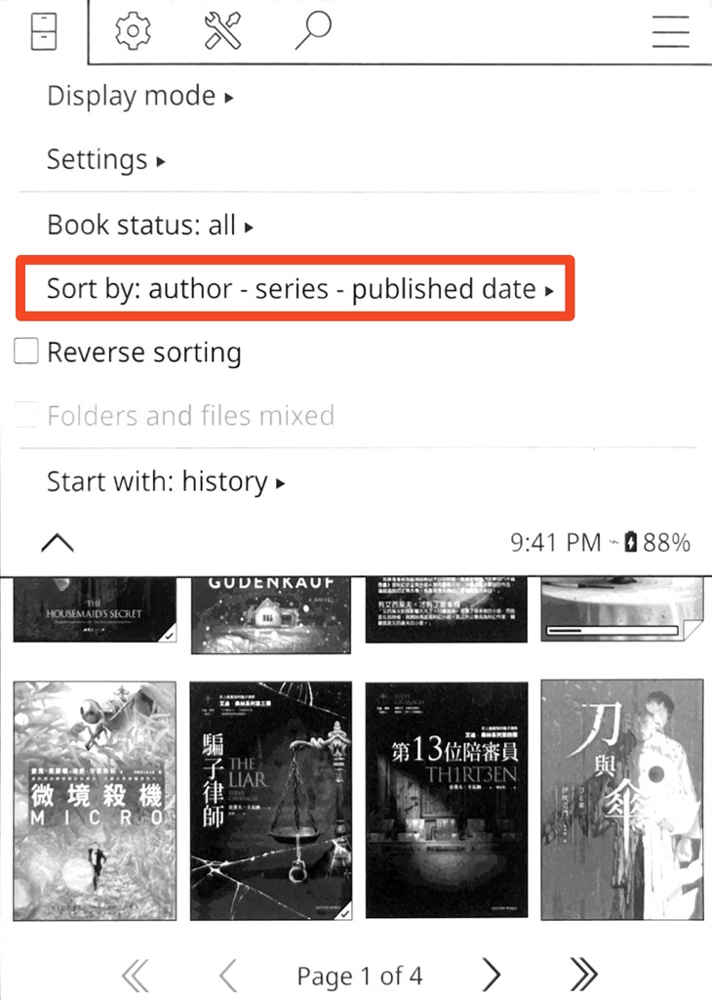

# KOReader Sort by Author-Series-Title Patch

A user patch for KOReader that sorts your ebooks in "Author - Series - Title" format.

## Features

- Adds a new "Author - Series - Title" sorting option in the file browser
- Makes it easier to find books by the same author or series
- Fully compatible with existing KOReader functionality

## Installation

For more information, visit: https://github.com/koreader/koreader/wiki/User-patches

1. Download the patch file
2. Create the `koreader/patches` folder if it doesn't exist yet
3. Copy the file to the `koreader/patches` folder
4. Restart KOReader

## Usage

1. Click the `Sort by:` menu item in the file browser
2. Select the "Author-Series-Title" option
3. Your ebooks will be reorganized according to the new format

## License

This project is licensed under the MIT License - see the [LICENSE](LICENSE) file for details.
